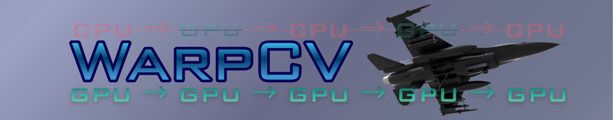
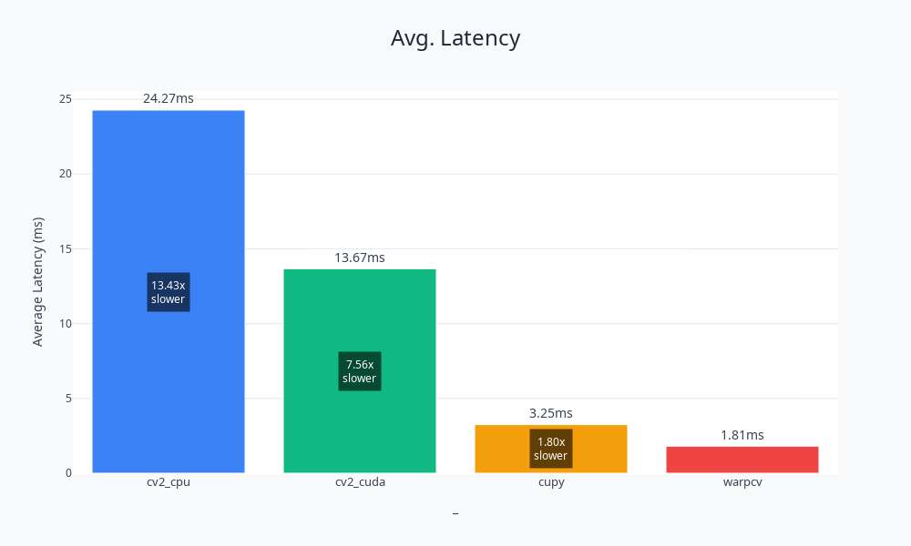
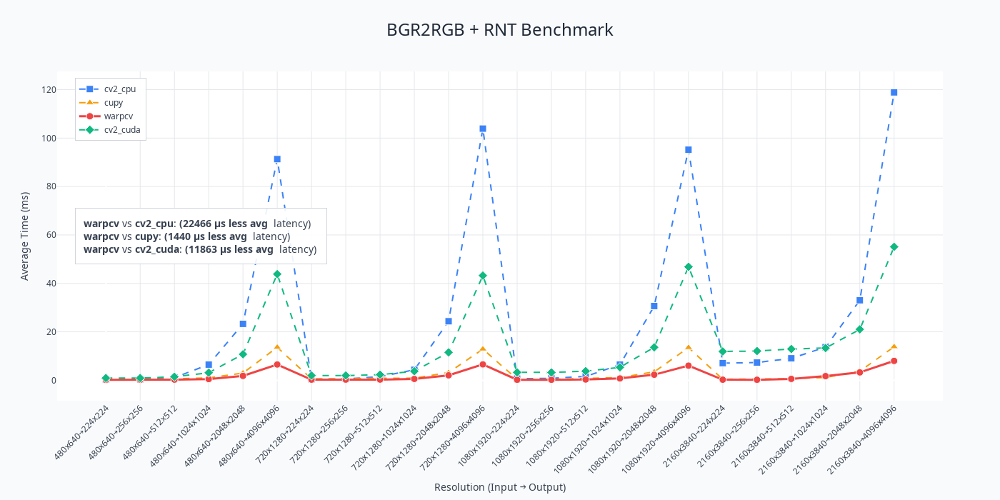
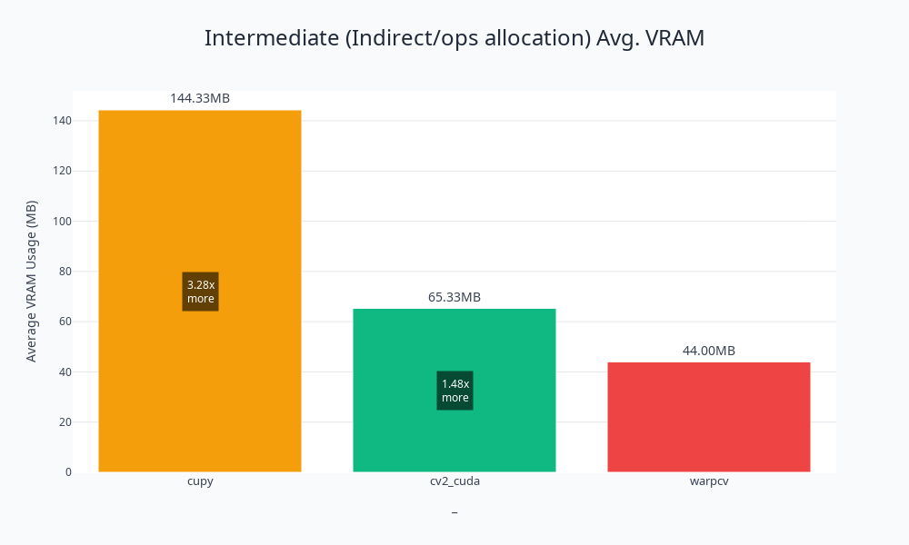
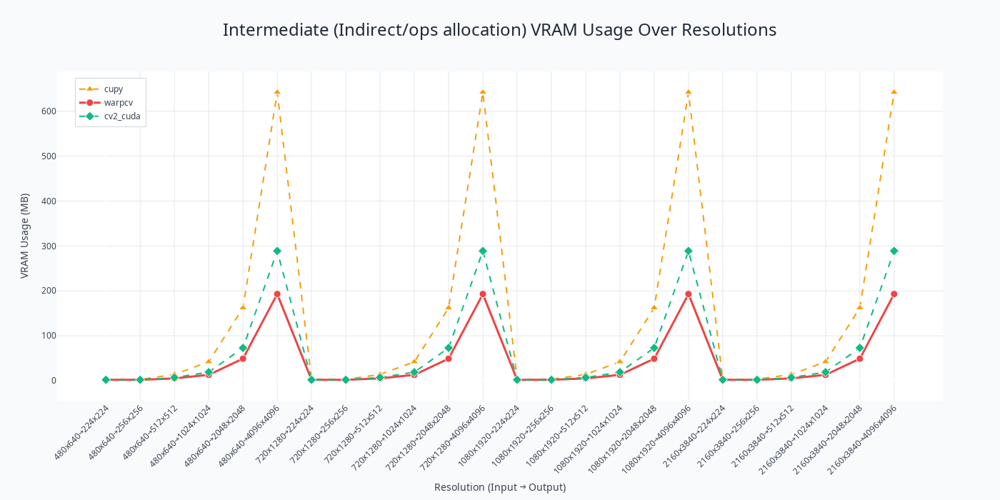

<p align="center">

</p>

---

# Comparison to OpenCV, OpenCV-CUDA, CuPy: Image pre/post proccessing

<table>
  <tr>
    <td></td>
    <td></td>
  </tr>
  <tr>
    <td></td>
    <td></td>
  </tr>
</table>

Tested on: RTX4070 Mobile (Ada Lovelace). With FP32 operations, WarpCV is **7.56x faster** than OpenCV-CUDA and **1.81x faster** than CuPy with noticeably more stable deviation for broad ranges of image resolution, accompanied by 3.28x (CuPy) and 1.48x (OpenCV-CUDA) less memory allocation from intermediate operations. WarpCV benefits both from latency and memory allocation where CuPy and OpenCV-CUDA has their own tradeoff.

---
### Why and When to Use WarpCV?

WarpCV is respectable to CuPy ecosystem by simplifying pre/post-processing for *micro to millisecond optimization* in CV inference pipelines which minimizes host-device memory transfers and eliminating inefficiencies that occur when multiple CUDA runtimes are mixed in a sequential production pipeline (e.g., CuPy, cv2.cuda, numba.cuda, NumPy, cuCIM).

The problem lies in context switching between CUDA runtimes that may or may not coexist with host offloading, which introduces significant latency and overhead that are common in TensorRT pipeline. It roots down to classical physics itself specific in the PCIe lane.

### Common Example:

### Example 1: OpenCV CUDA ↔ NumPy (Host-Device Transfers)

**The Problem:** Unnecessary memory copies between GPU and CPU

```python
import cv2
import numpy as np

# Traditional approach with cv2.cuda
gpu_mat = cv2.cuda_GpuMat()
gpu_mat.upload(cpu_image)

# Process on GPU
gpu_result = cv2.cuda.resize(gpu_mat, (640, 480))

# Download back to CPU (SLOW!)
cpu_array = gpu_result.download()

# Convert to numpy (additional overhead)
np_array = np.array(cpu_array)

# Upload again for next operation (SLOW!)
gpu_mat2 = cv2.cuda_GpuMat()
gpu_mat2.upload(np_array)
```

<div style="display: flex; align-items: flex-start; gap: 30px;">
  
  <span><strong>Latency introduced:</strong> Host-device memory transfers + NumPy conversion overhead + CUDA runtime context switching</span>
</div>


#### [See Reference](https://developer.nvidia.com/blog/machine-learning-frameworks-interoperability-part-2-data-loading-and-data-transfer-bottlenecks/)
---

### Example 2: CuPy ↔ OpenCV CUDA (Memory Pointer Copying)

**The Problem:** Converting between CuPy and cv2.cuda requires copying GPU memory pointers

```python
import cupy as cp
import cv2

# Start with CuPy array
cupy_array = cp.array(image, dtype=cp.uint8)

# Need to use cv2.cuda function - requires conversion related to Example 1
# Method 1: Via CPU (very slow)
cpu_temp = cp.asnumpy(cupy_array)  # GPU -> CPU
gpu_mat = cv2.cuda_GpuMat()
gpu_mat.upload(cpu_temp)  # CPU -> GPU

# Method 2: Via pointer manipulation (still has overhead)
gpu_mat = cv2.cuda_GpuMat(
    cupy_array.shape[0],
    cupy_array.shape[1],
    cv2.CV_8UC3,
    cupy_array.data.ptr
)
# This creates a copy of the pointer value, not zero-copy

# Process
result_mat = cv2.cuda.resize(gpu_mat, (640, 480))

# Convert back from cv2.cuda to NumPy and to CuPy ( more copying + 2x transfers! )
result_cupy = cp.asarray(result_mat.download())
```
**Latency introduced:** GPU memory pointer copying via `cudaMemcpyDeviceToDevice` + potential data layout differences (strides ) and runtime compatibility clashes for newer releases

---

### Example 3: Multiple CuPy Kernel Launches

**The Problem:** Each CuPy operation launches a separate kernel, even for operations on the same array

```python
import cupy as cp

# Load image to GPU
gpu_image = cp.array(image, dtype=cp.uint8)

# Operation 1: Resize (kernel launch #1)
resized = cp.resize(gpu_image, (640, 480, 3))

# Operation 2: Normalize (kernel launch #2)
normalized = resized.astype(cp.float32) / 255.0

# Operation 3: Transpose (kernel launch #3)
transposed = cp.transpose(normalized, (2, 0, 1))
```
<div style="display: flex; align-items: flex-start; gap: 30px;">
  
  <span><strong>Latency introduced:</strong> 3 separate kernel launches + GPU must wait for each kernel to complete where memory is read/written 3 times instead of once</span>
</div>


#### [See Reference](https://forums.developer.nvidia.com/t/kernel-switch-latency-successive-kernels-switch-latency/309504/2)
---

## WarpCV Solution

WarpCV provides **fused CUDA kernels** that combines multiple operation into a single kernel launch, staying entirely within the CuPy ecosystem with simplified abstraction and fine-grained control over block sizes, aiming for future proof compatibility for incoming GPU architectures:

```python
import cupy as cp
import warpcv.collection.standard.fused as wcsf
 
cupy_image = cp.array(image, dtype=cp.uint8)

mean = cp.array([123.675, 116.28, 103.53], dtype=cp.float32)
std = cp.array([58.395, 57.12, 57.375], dtype=cp.float32)


# Single fused kernel: resize + normalize + transpose
result = wcsf.fused_resize_normalize_transpose_3c(
    cupy_image,
    out_h=640,
    out_w=640,
    mean=mean,
    std=std,
    dtype=cp.float32,
    block_size=(32, 16, 2)
)
# Only 1 kernel launch for 3 operations!
```

WarpCV also provides **standalone (single) CUDA kernels** comparable to `cv2.cuda` functions as a derivative to the fused kernels:

```python
import cupy as cp
import warpcv.collection.standard.single as wcss

cupy_image = cp.array(image, dtype=cp.uint8)

# Comparable to: cv2.cuda.resize
resized_image = wcss.cupy_resize_3c(
    cupy_image,
    out_h=640,
    out_w=640,
    dtype=cp.float32,
    block_size=(32, 16, 2)
)

# Comparable to cv2.cuda.cvtColor(numpy_image, cv2.COLOR_BGR2RGB)
converted_image = wcss.cupy_cvt_bgr2rgb_float(
    resized_image, 
    dtype=cp.float32,
    block_size=(32, 16, 2)
)
```

### Compatibility

The collection is based on `cupy.RawKernel`, making each `warpcv.collection.*` function fully compatible with:

- `cupy.cuda.Stream` for asynchronous execution
- `cupy.cuda.Graph` for optimized kernel replay
- `cupy.cuda.Stream.synchronize` for high level synchronization
- All CuPy array objects and operations

```python
import cupy as cp
import pycuda.driver as cuda
import pycuda.autoinit
from cupy.cuda import Device
Device(0).use() # this avoids conflict with PyCUDA context
import warpcv.collection.standard.fused as wcsf

cupy_image = cp.array(image, dtype=cp.uint8)
mean = cp.array([123.675, 116.28, 103.53], dtype=cp.float32)
std = cp.array([58.395, 57.12, 57.375], dtype=cp.float32)

# Works seamlessly with PyCUDA streams and Graph for repeated tasks
stream = cuda.Stream() # Initialize PyCUDA Stream
cupy_stream = cp.cuda.ExternalStream(stream.handle) # Pass the pointer once from PyCUDA to CuPy
graph = None

for _ in range(0, 2):
    if graph is None:
        with cupy_stream:
            cupy_stream.begin_capture()
            result = wcsf.fused_resize_normalize_transpose_3c(
                cupy_image,
                out_h=640,
                out_w=640,
                mean=mean,
                std=std,
                dtype=cp.float32,
                block_size=(32, 16, 2)
            )
            graph = cupy_stream.end_capture()

    if graph is not None:
        graph.launch(cupy_stream)
        cupy_stream.synchronize()
```

### Environment Variables

By default, WarpCV sets compiler flag to `'-O2', '-v'` and sets the compiler to `'nvcc'`, however we can change this via environment variable that will apply to all imported kernels *after* setting the environment.
WarpCV passes `WCV_COMPILE_OPTIONS` for NVCC flags and `WCV_BACKEND` for chosing between `'nvcc'` or `'nvrtc' (CuPy's default)` compilers which are passed to `cupy.RawKernel(..., options, backend)`

via current terminal session:

```bash
#!bin/bash
export WCV_COMPILE_OPTIONS='["-O3", "--use_fast_math"]' # This will pass as ('-O3', '--use_fast_math') to cupy.RawKernel(..., options)
export WCV_BACKEND='nvcc' # CuPy by default uses 'nvrtc' for JIT compilation, this will pass to to cupy.RawKernel(..., backend)
```

```python
import cupy as cp
import warpcv.collection.standard.single as wcss
cupy_image = cp.array(image, dtype=cp.uint8)
# This kernel will now compile with 'nvcc' compiler and "-O3", "--use_fast_math" flags
resized_image = wcss.cupy_resize_3c(
    cupy_image,
    out_h=640,
    out_w=640,
    block_size=(32, 16, 2)
)
```

via `os.environ`:

```python
import os
import json
import cupy as cp

# Set environment first before importing warpcv
os.environ['WCV_COMPILE_OPTIONS'] = json.dumps(["-O3", "--use_fast_math"])
os.environ['WCV_BACKEND'] = 'nvcc'

# Import warpcv will initialize SetOptions(*GetWCVEnv()) under collections/utils.py which gets context from the environment variables.
import warpcv.collection.standard.single as wcss
 
cupy_image = cp.array(image, dtype=cp.uint8)
resized_image = wcss.cupy_resize_3c(
    cupy_image,
    out_h=640,
    out_w=640,
    block_size=(32, 16, 2)
)


```

---

## Installation (Linux)

via PyPI Virtual Environment

```bash
git clone --recursive https://github.com/RezkyKam50/warpcv.git
pip install -e .
```

Build from Source

```bash
#!bin/bash
git clone --recursive https://github.com/RezkyKam50/warpcv.git
cd warpcv
./configure.sh
```

#### For profiling, see the [NVIDIA Nsight Systems User Guide](https://docs.nvidia.com/nsight-systems/UserGuide/index.html).

#### WarpCV doesn't implement a built-in [NVTX](https://github.com/NVIDIA/NVTX.git) marking on each kernel function.

---

## License

MIT License - See LICENSE file

---

## References

```bibtex
@inproceedings{cupy_learningsys2017,
  author       = "Okuta, Ryosuke and Unno, Yuya and Nishino, Daisuke and Hido, Shohei and Loomis, Crissman",
  title        = "CuPy: A NumPy-Compatible Library for NVIDIA GPU Calculations",
  booktitle    = "Proceedings of Workshop on Machine Learning Systems (LearningSys) in The Thirty-first Annual Conference on Neural Information Processing Systems (NIPS)",
  year         = "2017",
  url          = "http://learningsys.org/nips17/assets/papers/paper_16.pdf"
}
```
